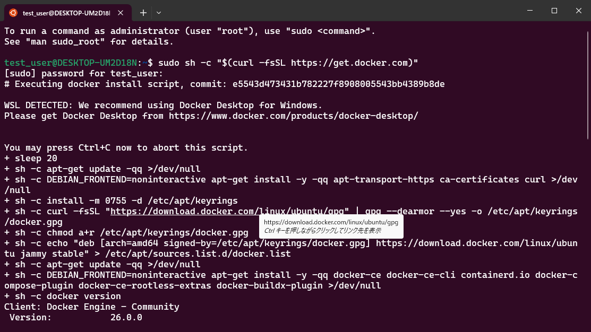
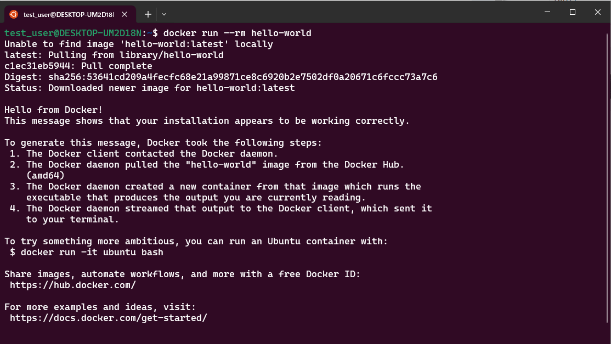

# やや丁寧なDockerのインストール

## 1. 前準備

前準備としてwslの更新を行っておく

Windows PowerShellにて以下のコマンドを実行
```pwsh
wsl --update
```

## 2. Docker Engineのインストール

> [!NOTE]
> wslと言えばLINUXのシステムを指すが、これ以降ではUbuntu自体をwslと呼んでいる

以下の5行のコマンドをwsl内で実行

まずパッケージの更新を行っておく
```sh
sudo apt update && sudo apt upgrade -y
```

Docker Engineのインストール
```sh
sudo sh -c "$(curl -fsSL https://get.docker.com)"
```

<!-- get.docker.comからインストールスクリプトを直接実行している位の注釈を入れるか？ -->

ルート以外のユーザでもdockerコマンドを使用可能にする
```sh
sudo usermod -aG docker $USER
```

systemdを有効化させる
```sh
sudo sh -c 'echo "[boot]\nsystemd=true" > /etc/wsl.conf'
```


その後、wslのウィンドウを閉じ、PowerShellにて以下のコマンドを実行
```sh
wsl --shutdown
```

## 3. dockerの動作確認
再度wslを起動し、以下のコマンドを実行
```sh
docker run --rm hello-world
```
画像のような出力が出てくればDockerの導入は成功

